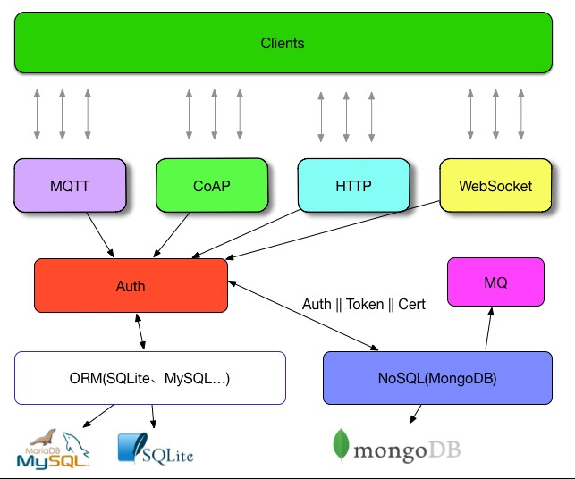

# Lan

> A CoAP,MQTT,HTTP,WebSocket Server of Internet of Things.

A similar project before this: [Ponte](https://github.com/eclipse/ponte)

##TODO

1. add account center (Phodal, Ongoing...)

2. add Auth support for WebSocket

3. example for Arduino、NodeMCU、51 ...

4. add RSA Support for WebSocket、MQTT、HTTP、CoAP

5. add get data support

6. create docker image for deploy

7. configureable

###Done

1. basic auth for WebSocket,MQTT,HTTP,CoAP

2. setup database

3. module loader

##Configure(in design)

Current design:

	{
		useRegister: false
		encrypt: 'bcrypt',
		authDB: 'sqlite3',
		dataDB: 'MongoDB',
		modules: ['coap', 'http', 'mqtt', 'websocket']
	}

##Test With Tool

###HTTP PUT/POST - cUrl

    curl -X PUT -d '{ "dream": 1 }' -H "Content-Type: application/json" http://localhost:8899/topics/test

with authenticate

    curl --user root:root -X PUT -d '{ "dream": 1 }' -H "Content-Type: application/json" http://localhost:8899/topics/test

###MQTT PUT/POST - Mosquitto

    mosquitto_pub -h localhost -d -t lettuce -m "Hello, MQTT. This is my first message."
    
with authenticate

    mosquitto_pub -u root -P root -h localhost -d -t lettuce -m "Hello, MQTT. This is my first message."

###CoAP PUT/POST - libcoap

    coap-client -m get coap://127.0.0.1:5683/topics/zero -T
    
with authenticate

``Use CoAP Option for Authenticate``      
    
##Setup

``require``: Install

1. ``MongoDB``
2. ``Sqlite`` or ``MySQL``

Then.

1.Install dependencies

    npm install

2.Setup Database

    sequelize db:migrate 

3.Run

    node app.js

Inspired by
[https://github.com/mcollina/qest](https://github.com/mcollina/qest)

##License

© 2015 [Phodal Huang][phodal]. This code is distributed under the MIT
license.

[phodal]:http://www.phodal.com/
